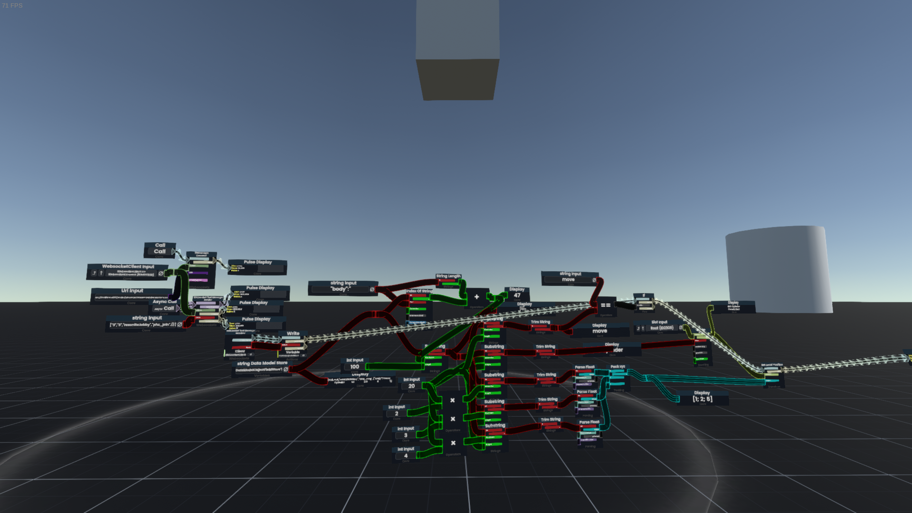
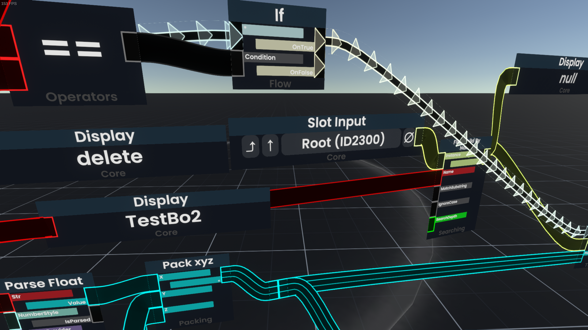
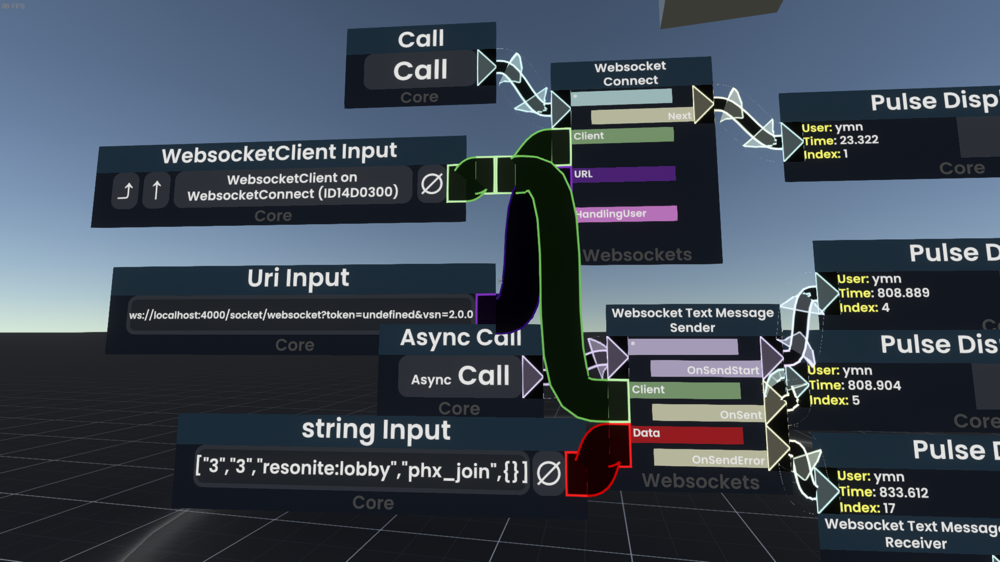
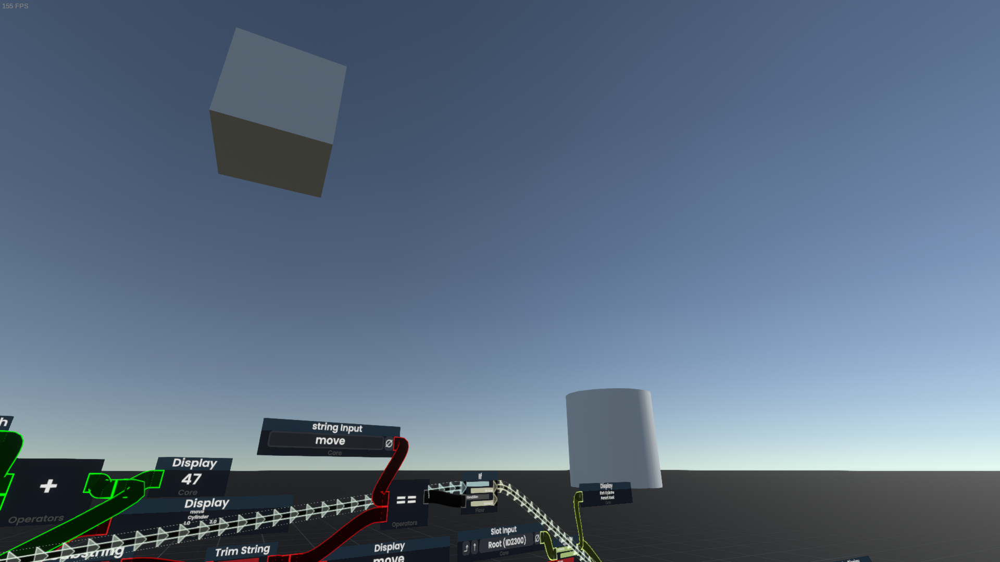

# ElixirからResoniteを操作するライブラリ

### 起動方法

#### WebSocketサーバー

```sh
$ cd elixir_to_resonite_server
$ mix phx.server
```

#### Resoniteクライアント

1)
```
ProtoFlux/V0.001/elixir_to_resonite.resonitepackage
```
ワールドにインポートしてください

2) アンパックしてください

3) Slot InputをRootに設定しいください

4) 「Call」と「Async Call」を押してください

5) 「Cylinder」と「Box」を作成してください


#### Elixir操作クライアント
サンプルの実行

```sh
$ cd elixir_to_resonite_client
$ mix run -e "ElixirToResoniteClient.hello()"
```

# 動作動画
https://www.youtube.com/embed/MfnUzYgfaao